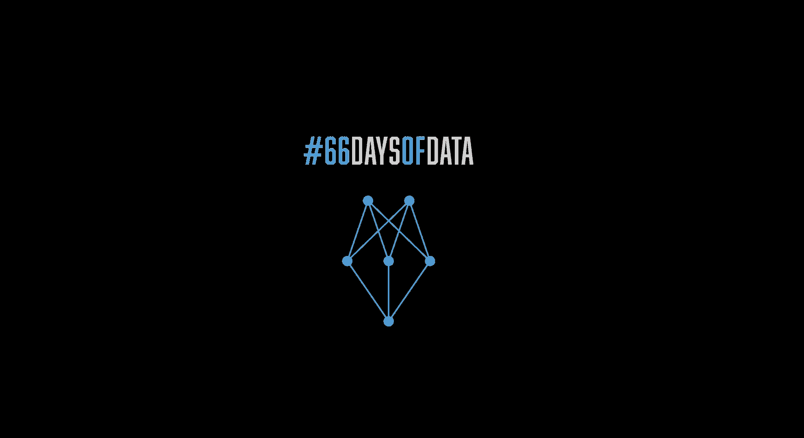

## Hi there 👋

## My Name is Ahmed And i ~~like Coding~~ code.

  

- 🌱 I’m currently participating in the #66DaysofData initiated by ken-jee.

- 👨‍💻 All of my projects are available at [https://github.com/ApolloDev0](https://github.com/ApolloDev0)

📫 How to reach me **leapollo2005@gmail.com**

<h3 align="left">Languages and Tools:</h3>

       

<h3></h3>
 

**Visitors Count**

